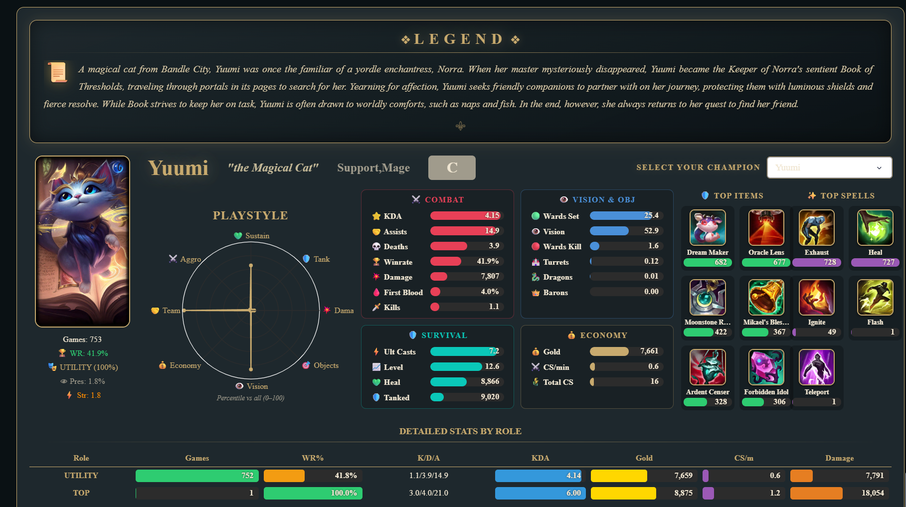
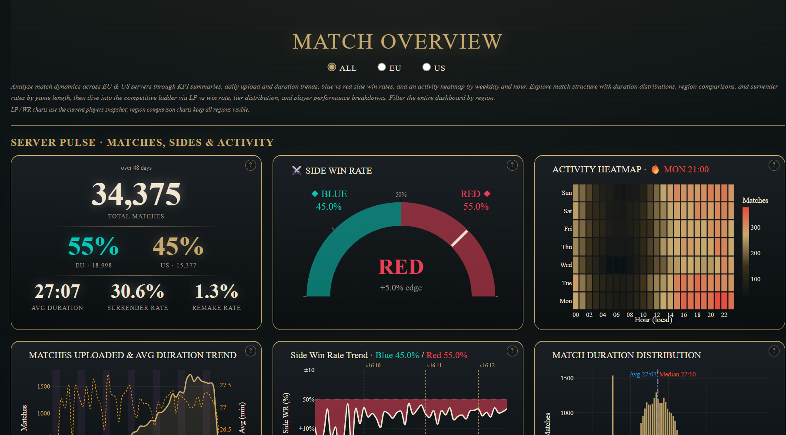
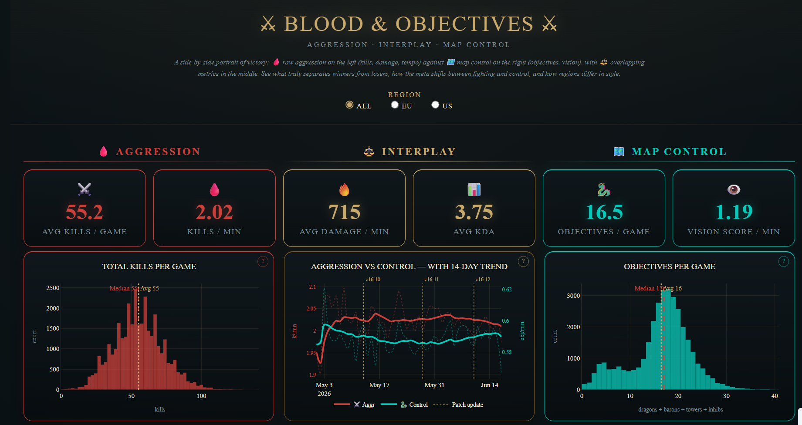
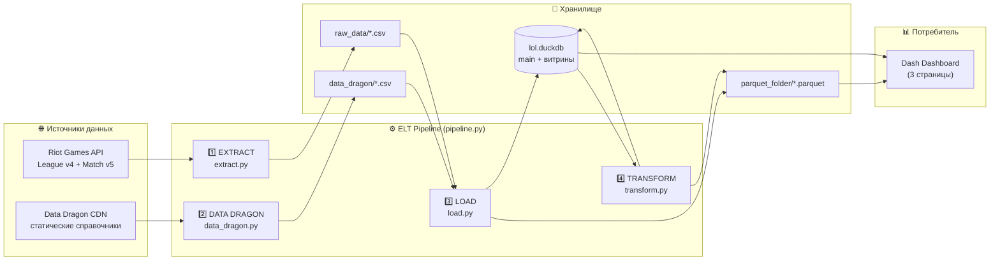
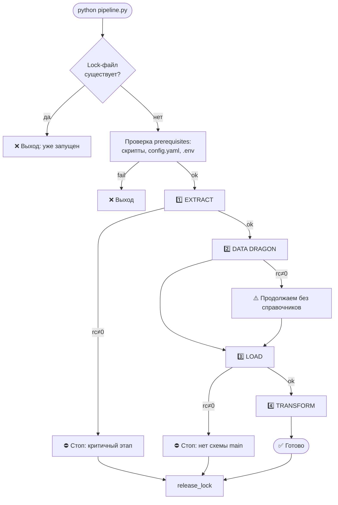
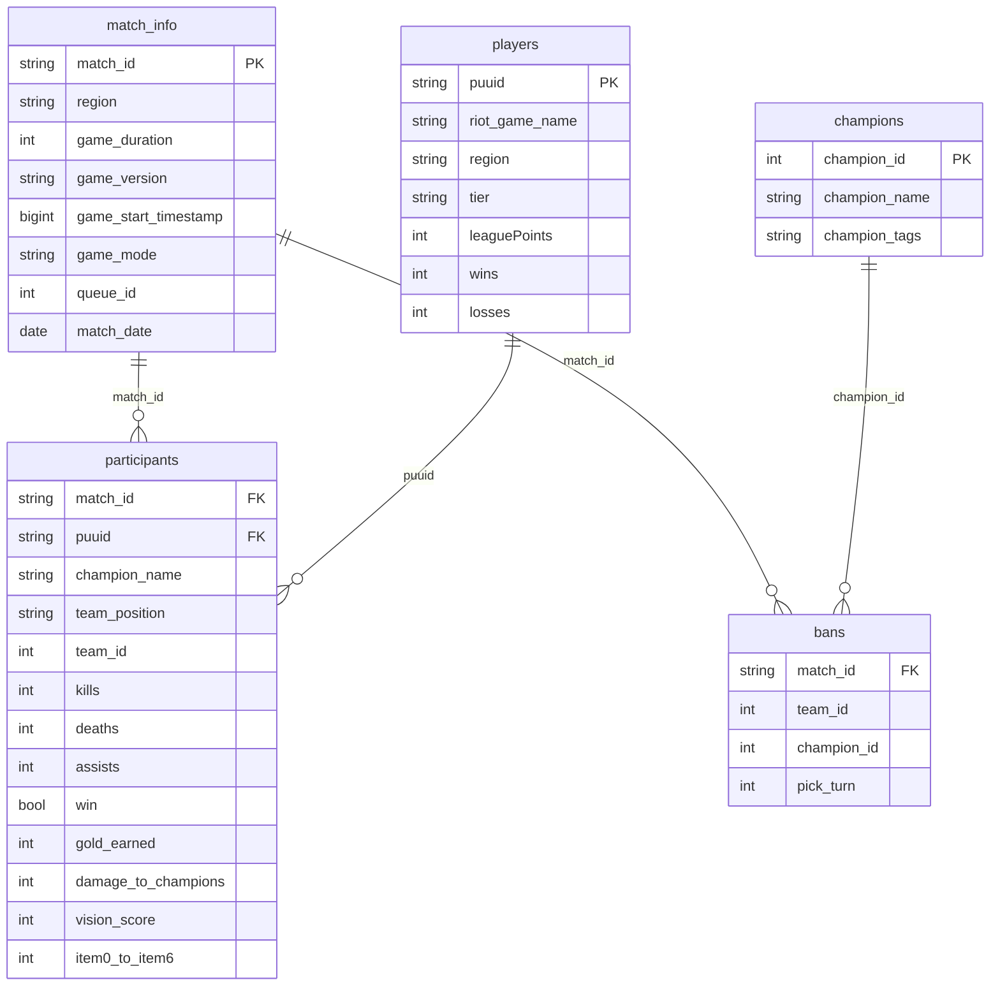
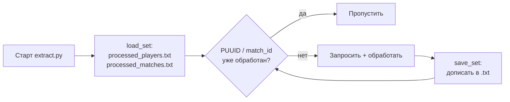

# Nexus Insights — League of Legends Analytics Platform


**Nexus Insights** — это законченная end-to-end платформа аналитики **League of Legends**:
автоматизированный **ELT-пайплайн** (Extract → Load → Transform) для сбора, очистки и
агрегации киберспортивной статистики высокого MMR и интерактивный **BI-дашборд** на Dash/Plotly
для исследования меты. Данные извлекаются из официального Riot Games API, обогащаются
статическими справочниками Data Dragon и превращаются в аналитические витрины в **DuckDB**,
которые затем визуализируются в трёхстраничном веб-приложении.

---

<p align="center">
  <a href="https://Urizen-Data-lol-dashboard.hf.space">
    
  </a>
</p>

---

## Скриншоты дашборда

### Страница 1: Champions Meta
Анализ силы, популярности и эффективности чемпионов: тир-листы, радар Playstyle, детальные карточки.



### Страница 2: Match Overview
Пульс серверов, структура матчей и состояние соревновательной лестницы.



### Страница 3: Blood & Objectives
Философия «агрессия против контроля»: боевые метрики, объекты, сравнение регионов.



---

## Содержание

- [Production-дашборд](#production-дашборд)
- [Назначение и практическая ценность](#назначение-и-практическая-ценность)
- [Архитектура платформы](#архитектура-платформы)
- [Структура проекта](#структура-проекта)
- [Этапы пайплайна (ELT)](#этапы-пайплайна-elt)
- [Модель данных и слои](#модель-данных-и-слои)
- [Витрины для дашборда](#витрины-для-дашборда)
- [Дашборд (BI-приложение)](#дашборд-bi-приложение)
- [Установка и запуск](#установка-и-запуск)
- [Docker-контейнеризация и деплой](#docker-контейнеризация-и-деплой)
- [Конфигурация](#конфигурация)
- [Отказоустойчивость и инженерные решения](#отказоустойчивость-и-инженерные-решения)
- [Проверка результата](#проверка-результата)
- [Docker-контейнеризация и деплой](#docker-контейнеризация-и-деплой)
- [FAQ и troubleshooting](#faq-и-troubleshooting)
- [Технологический стек](#технологический-стек)
- [Лицензия](#лицензия)

---

## Production-дашборд

Дашборд развёрнут на Hugging Face Spaces и доступен 24/7 без ограничений по времени.

<p align="center">
  <a href="https://Urizen-Data-lol-dashboard.hf.space">
    
  </a>
</p>

---

## Назначение и практическая ценность

Мета League of Legends меняется с каждым патчем. Для принятия решений на высоком уровне
необходима точная и актуальная статистика. Платформа собирает матчи игроков топ-лиг
(**Challenger / Grandmaster / Master**) двух регионов (**Европа, EUW** и **Северная Америка, NA**),
нормализует их и строит готовые аналитические витрины, поверх которых работает дашборд.

**Целевая аудитория:**

| Кому | Зачем |
| :--- | :--- |
| **Киберспортивным аналитикам и тренерам** | Изучение эффективности пиков/банов, оценка стилей игры (Playstyle), сравнение регионов EU/US |
| **Дизайнерам баланса** | Champion Strength Score, Power Ban Index, presence — метрики силы чемпионов |
| **Продвинутым игрокам (High ELO)** | Адаптация к текущей мете, оптимальные сборки предметов, винрейт и KDA чемпионов |
| **Data-инженерам** | Референсный пример воспроизводимого ELT с DuckDB + Parquet |

**Ключевые возможности:**

- Сравнение меты между регионами **Европа (EUW)** и **Северная Америка (NA)**.
- Анализ винрейта, пикрейта, банрейта и предметных сборок чемпионов.
- Оценка боевых и макро-метрик (урон в минуту, обзор, контроль объектов).
- Устойчивость к сбоям сети и API-лимитам (автоматические ретраи и механизм `resume`).
- Интерактивная визуализация во всех трёх разрезах: мета чемпионов, обзор матчей, бои и объекты.

---

## Архитектура платформы

Проект построен по современной методологии **ELT**. Сначала сырые данные извлекаются и
загружаются в хранилище, и только затем трансформируются средствами SQL внутри DuckDB.
Дашборд выступает потребителем готовых витрин и не выполняет тяжёлых вычислений.



**Оркестрация.** Все этапы управляются центральным скриптом `pipeline.py`, который гарантирует
строгую последовательность выполнения, защищает от параллельных запусков (через `.pipeline.lock`)
и ведёт единый лог процесса.

### Почему ELT, а не ETL?

Трансформации (тяжёлые агрегации, оконные функции, перцентили) выполняются **внутри DuckDB**
после загрузки сырых данных. Это даёт:

- высокую скорость (колоночный движок, векторизация);
- возможность пересчитывать витрины без повторного обращения к API;
- чистое разделение слоёв (raw → main → marts).

---

## Структура проекта

Папка `dashboard/` является составной частью проекта и располагается внутри корневой
директории ELT-пайплайна. Дашборд читает базу `lol.duckdb` из соседней папки `parquet_folder/`.

```text
ELT/
│
├── pipeline.py             # Главный оркестратор пайплайна (E → DD → L → T)
├── extract.py              # Сбор сырых данных из Riot API
├── data_dragon.py          # Загрузка статических справочников
├── load.py                 # Очистка, нормализация, загрузка в DuckDB
├── transform.py            # Создание аналитических витрин (SQL)
│
├── config.yaml             # Конфигурация пайплайна (лимиты, пути, даты)
├── requirements.txt        # Зависимости Python (пайплайн)
├── .env                    # Секреты (RIOT_API_KEY) — не пушится в Git
├── .gitignore
│
├── raw_data/               # [генерируется] сырые CSV от extract.py
│   ├── matches_participants.csv
│   └── bans.csv
├── data_dragon/            # [генерируется] справочники
│   ├── champions.csv  items.csv  spells.csv  icons.csv
│   └── version.txt
├── processed_csv/          # [генерируется] очищенные CSV (для отладки)
├── parquet_folder/         # [генерируется] база данных и витрины
│   ├── lol.duckdb          # основная база DuckDB (main + витрины)
│   ├── *.parquet           # main-таблицы (match_info, participants, bans, ...)
│   ├── lol_meta/           # витрины для страницы Champions Meta
│   ├── match_overview/     # витрины для страницы Match Overview
│   └── combat/             # витрины для страницы Blood & Objectives
│
├── processed_players.txt   # [генерируется] resume: обработанные PUUID
├── processed_matches.txt   # [генерируется] resume: обработанные match_id
├── pipeline.log            # [генерируется] лог оркестратора
├── .pipeline.lock          # [временный] защита от параллельного запуска
│
└── dashboard/              # BI-приложение (Dash / Plotly)
    ├── app.py              # Точка входа: навигация, переключение вкладок, запуск
    ├── common.py           # Общий модуль: конфиг, палитра, стили, утилиты, подсказки
    ├── page_champions.py   # Страница 1 — Champions Meta
    ├── page_overview.py    # Страница 2 — Match Overview
    ├── page_combat.py      # Страница 3 — Blood & Objectives
    ├── requirements.txt    # Зависимости Python (дашборд)
    └── assets/
        └── style.css       # Глобальные стили: навбар, info-подсказки, ссылки автора
```

---

## Этапы пайплайна (ELT)

### Оркестратор — `pipeline.py`

Единая точка входа, управляющая последовательностью `EXTRACT → DATA DRAGON → LOAD → TRANSFORM`.



**Логика критичности этапов:**

| Этап | Критичность | Поведение при ошибке |
| :--- | :--- | :--- |
| EXTRACT | критичный | Остановка пайплайна |
| DATA DRAGON | некритичный | Предупреждение, продолжение |
| LOAD | критичный | Остановка (без `main` упадёт transform) |
| TRANSFORM | финальный | Фиксация результата, завершение |

### 1. Extract (`extract.py`)

Собирает динамические данные из Riot API.

- **Двухэтапный отбор игроков:** сначала собирается широкий пул (топ-200 из каждой лиги/региона),
  чтобы избежать перекоса в сторону одного региона, затем выбирается топ-N по LP пропорционально
  по каждому `(region, tier)`.
- **Устойчивость:** использует `tenacity` для ретраев с экспоненциальным backoff, уважает Rate Limits (429), делает паузы.
- **Resume:** сохраняет прогресс в `.txt` файлы — при обрыве связи перезапуск продолжается с того же места.
- **Инкрементальная запись:** данные сбрасываются в CSV буферами, чтобы не потерять прогресс при падении.

**Эндпоинты Riot API:**

| Эндпоинт | Назначение |
| :--- | :--- |
| `GET /lol/league/v4/{tier}leagues/by-queue/RANKED_SOLO_5x5` | Игроки топ-лиг |
| `GET /lol/match/v5/matches/by-puuid/{puuid}/ids?queue=420` | ID рейтинговых матчей |
| `GET /lol/match/v5/matches/{matchId}` | Детальный JSON матча |

**Регионы:**

| Логический | League v4 (platform) | Match v5 (routing) |
| :--- | :--- | :--- |
| `EU` | `euw1` | `europe` |
| `US` | `na1` | `americas` |

### 2. Data Dragon (`data_dragon.py`)

Загружает статические справочники (чемпионы, предметы, заклинания, иконки) для обогащения данных
(замена ID на названия).

- Проверяет актуальную версию патча.
- Не перекачивает данные, если версия не изменилась (экономия трафика и времени).
- Кеширование по версии: `version.txt` сравнивается с актуальной версией CDN — повторное скачивание выполняется только при смене патча или с флагом `--force`.

### 3. Load (`load.py`)

Подготавливает данные для аналитики: **CSV → Parquet → DuckDB (схема `main`)**.

- Приводит типы данных (строки, int64, bool), конвертирует `timestamp` в `match_date`.
- **Нормализация:** разделяет «плоскую» таблицу участников на `match_info` (1 строка = 1 матч)
  и `participants` (10 строк на матч), убирая дублирование информации о матче.
- Конвертирует данные в колоночный формат **Parquet**.
- Загружает все таблицы в сырую схему `main` в **DuckDB**.
- **Fallback при записи Parquet:** если `df.to_parquet` падает из-за несовместимости типов,
  `load.py` автоматически конвертирует через временный CSV + DuckDB `COPY ... (FORMAT PARQUET)`.

### 4. Transform (`transform.py`)

Строит **17 аналитических витрин** в трёх схемах DuckDB с помощью SQL-запросов.

- Рассчитывает метрики: Winrate, Pickrate, Banrate, KDA, DPM (Damage Per Minute), VPM (Vision Per Minute).
- Вычисляет кастомные индексы: **Presence**, **CSS Score** (Champion Strength Score), **PBI** (Power Ban Index).
- Генерирует бины для гистограмм (в JSON) и семплы для 2D-плотности и KDA-violin графиков.

Все агрегации выполняются на стороне **SQL (DuckDB)**, результаты сохраняются и в Parquet,
и обратно в DuckDB (в соответствующие схемы).

---

## Модель данных и слои

После выполнения пайплайна база `lol.duckdb` содержит 4 логических слоя.

| Слой | Где хранится | Описание |
| :--- | :--- | :--- |
| **Raw** | `raw_data/*.csv` | Сырые выгрузки из API «как есть» |
| **Staging / Reference** | `data_dragon/*.csv`, `processed_csv/*.csv` | Справочники + очищенные данные |
| **Core (`main`)** | `DuckDB.main`, `parquet_folder/*.parquet` | Нормализованные, типизированные таблицы |
| **Marts (витрины)** | `DuckDB.lol_*`, `parquet_folder/{schema}/` | Предагрегированные витрины для дашборда |

### Схема `main` (Core Layer)



---

## Витрины для дашборда

### Схема `lol_meta` — Champions Meta (страница 1)

| Витрина | Содержание |
| :--- | :--- |
| `df_all` | Статистика чемпионов по регионам + presence, css_score, pbi, tier |
| `df_by_role` | То же с разбивкой по `team_position` |
| `df_items` | Топ предметов по чемпионам (UNPIVOT item0–item6) |
| `SPELLS_DF` | Топ summoner spells по чемпионам |
| `EXTRA_DF` | Vision, healing, wards, spell casts, firstblood_rate |
| `RADAR_BASE` | 8 осей playstyle-радара (перцентили: damage, tank, vision, ...) |

**Производные метрики:**

| Метрика | Формула |
| :--- | :--- |
| **Presence** | `Pick% + Ban%` (cap 100) |
| **CSS** (Champion Strength Score) | `(norm(WR)·0.5 + norm(Pick)·0.3 + norm(Ban)·0.2) · 100` |
| **PBI** (Power Ban Index) | `(WR − avgWR) · Pick% / (100 − Ban%)` |
| **Tier** | S+/S/A/B/C по квантилям CSS (0.20, 0.50, 0.80, 0.95) |

### Схема `lol_match_overview` — Match Overview (страница 2)

| Витрина | Содержание |
| :--- | :--- |
| `match_overview_matches` | Базовая инфо о матчах (дата, длительность, версия, timestamp) |
| `match_overview_sides` | Баланс синей/красной стороны (`blue_win`) |
| `match_overview_cancel` | Сдачи и ремейки (`surrendered`, `game_duration`) |
| `match_overview_players` | LP, tier, wins/losses игроков |

### Схема `lol_combat` — Blood & Objectives (страница 3)

| Витрина | Содержание |
| :--- | :--- |
| `combat_match` | Агрегаты уровня матча (kills, deaths, assists, dragons, barons, towers, inhibitors) |
| `combat_team` | Агрегаты уровня команды (first_blood, dragons, barons по `team_id`) |
| `combat_player_agg` | Средние kpm, dpm, kda, kp, vpm по `region × win` |
| `combat_hist_dpm` | Бины гистограммы Damage/min (JSON, по регионам) |
| `combat_hist_vpm` | Бины гистограммы Vision/min (JSON, по регионам) |
| `combat_density_2d` | Семпл матчей для 2D-плотности (DPM vs KP) |
| `combat_violin_kda` | Семпл строк для KDA-violin |

> **Гистограммы в JSON:** бины сериализуются в `counts_json` — компактное хранение распределения (lo, hi, width, nbins, median, avg, counts).
> **Семплирование:** `USING SAMPLE N PERCENT` для тяжёлых визуализаций (плотность, violin).

---

## Дашборд (BI-приложение)

Интерактивное многостраничное веб-приложение на **Plotly Dash** (`dashboard/`), работающее
поверх готовых витрин. Тяжёлые SQL-агрегации выполнены на этапе `transform.py`, а дашборд
лишь читает витрины и рендерит их — это обеспечивает мгновенный отклик UI. Кэширование
агрегаций реализовано через `lru_cache`, а база DuckDB открывается исключительно на чтение.

### Страницы

**1. Champions Meta** — анализ силы, популярности и эффективности чемпионов.

- Карточки лидеров (Strongest, Best Winner, Most Popular, Most Banned, Best KDA, Best Killer).
- Rank List — тир-лист (S+ → C) на основе Champion Strength Score *(норм. WR×0.5 + Pick×0.3 + Ban×0.2)*.
- Tier Distribution — интерактивная гистограмма тиров (фильтрует scatter мультивыбором).
- Scatter WR vs Pick Rate — пузырьки (размер = Ban Rate), квадранты *Overpowered / Hidden OP / Popular but Weak / Weak*.
- Таблица чемпионов с 20+ метриками и цветными progress-bar.
- Детальная карточка чемпиона: портрет, лор, радар Playstyle (8 осей), сетка метрик 2×2,
  топ предметов, топ заклинаний, статистика по ролям.

**2. Match Overview** — пульс серверов, структура матчей и состояние ladder.

- SERVER PULSE: KPI-панель, Side Win Rate Gauge, Activity Heatmap *(локальное время игроков)*.
- Тренды: загруженные матчи + средняя длительность, винрейт Blue-side *(с границами патчей)*, распределение длительности.
- MATCH STRUCTURE: boxplot длительности по регионам, surrender rate по длительности, LP vs Win Rate.
- THE LADDER: donut-кольца тиров (EU/US), распределение LP по тирам *(гистограмма + KDE)*, violin винрейта игроков.

**3. Blood & Objectives** — философия «агрессия против контроля» в трёхзональной вёрстке.

- **Aggression (Blood)** • **Interplay (Gold)** • **Map Control (Teal)**.
- 6 KPI-плиток по зонам.
- Распределения: Total Kills, Objectives per Game *(из предрассчитанных JSON-бинов)*.
- Взаимосвязи: KDA Winners vs Losers (violin), Kills vs Game Length (scatter), OCI Composition (stacked).
- Метрики игроков: Damage/min, Vision/min (гистограммы), Winners' Edge (что выигрывает игры).
- Gauge-индикаторы: First Blood → Win, Vision Advantage, Region Compare (diverging bar).

### Интерактивность и UX

| Возможность | Реализация |
| :--- | :--- |
| **Фильтры** | Регион (ALL / EU / US), роль, минимальное число игр (слайдер) |
| **Реактивные callbacks** | Все графики страницы обновляются одним callback при смене фильтра |
| **Контекстные подсказки** | Иконка «?» на каждой панели → tooltip с пояснением, как читать график (`CHART_INFO`) |
| **Живые иконки Data Dragon** | Чемпионы и предметы — с CDN Riot; заклинания — из локального справочника `main.spells` (отказоустойчиво) |
| **Локальное время игроков** | Heatmap активности учитывает CET/CEST (EU) и ET (US) с поправкой на летнее время |

### Принципы дизайна дашборда

| Принцип | Реализация |
| :--- | :--- |
| **Single Source of Truth** | Все константы, стили, палитра и утилиты централизованы в `common.py`; страницы импортируют общий модуль |
| **Compute-once, render-many** | Агрегаты считаются один раз в SQL; дашборд их только читает |
| **Read-only к данным** | DuckDB открывается исключительно на чтение — UI не пишет в базу |
| **Graceful degradation** | Если онлайн-ресурс недоступен, используется локальный справочник — UI не ломается |
| **Один callback на страницу** | Смена фильтра региона обновляет все графики страницы синхронно за один проход |

### Дизайн-система

Единый визуальный язык вдохновлён эстетикой League of Legends и централизован в `common.py`.

| Роль | HEX |
| :--- | :--- |
| Primary (золото) | `#C8AA6E` |
| Background (тёмный) | `#0A1114` |
| Text | `#F0E6D2` |
| Win Rate | `#2ECC71` |
| Ban Rate / Red Side | `#E84057` |
| Blue Side / Teal | `#0AC8B9` |
| KDA / Damage | `#F39C12` |
| Vision | `#9B59B6` |

- **Шрифт:** `Beaufort for LoL` → `Marcellus` → `Times New Roman` (serif fallback).
- **Панели графиков:** скруглённые карточки с цветным `borderTop` и мягким свечением.
- **Зональные акценты** (страница 3): Blood (красный) • Gold (золотой) • Teal (бирюзовый).
- **Адаптивная сетка:** CSS Grid с минимальной шириной контента `1400px`.

---

## Установка и запуск

### Предварительные требования

- Python **3.10+** (используется синтаксис `str | None`, `list[str]`).
- Riot Games **Development API Key** ([получить](https://developer.riotgames.com/)).

### 1. Подготовка окружения

```bash
# Клонирование репозитория
git clone https://github.com/Urizen-Data/nexus-insights.git
cd nexus-insights

# Создание и активация виртуального окружения
python -m venv .venv
source .venv/bin/activate        # Linux / macOS
# .venv\Scripts\activate         # Windows

# Установка зависимостей пайплайна
pip install -r requirements.txt
```

### 2. Настройка секретов

Создайте файл `.env` в корне проекта и добавьте ваш Riot API ключ:

```dotenv
RIOT_API_KEY=RGAPI-xxxxxxxx-xxxx-xxxx-xxxx-xxxxxxxxxxxx
```

> Ключ читается только из `.env`, не хранится в коде и не коммитится (`.env` в `.gitignore`).
> Development API Key Riot действует 24 часа — обновляйте перед каждым большим прогоном.

### 3. Настройка конфигурации

Откройте `config.yaml`.

> **Важно:** параметр `combat_start_date` должен быть установлен на **реальную дату в прошлом**
> относительно дат собранных матчей (например, первое число текущего месяца/патча), иначе фильтр
> `match_date >= DATE '...'` отсечёт все строки и витрины `match_overview` и `combat` окажутся пустыми.

### 4. Запуск пайплайна

```bash
# Полный прогон (Extract → Data Dragon → Load → Transform)
python pipeline.py
```

**Полезные команды оркестратора:**

```bash
# Пропустить долгий сбор данных из API (если raw_data уже скачана)
python pipeline.py --skip-extract

# Пропустить сбор данных и справочники — пересобрать main + витрины из готовых CSV
python pipeline.py --skip-extract --skip-data-dragon

# Запустить ТОЛЬКО создание витрин (полезно при отладке SQL в transform.py)
python pipeline.py --only transform

# Принудительно обновить справочники Data Dragon после выхода нового патча
python pipeline.py --skip-extract --force-data-dragon --skip-transform

# Пропустить этап Load (если схема main в DuckDB уже создана)
python pipeline.py --skip-load
```

**Запуск отдельных модулей (для разработки и отладки):**

```bash
python extract.py        # только сбор данных из Riot API
python data_dragon.py    # только справочники (--force для перекачки)
python load.py           # только CSV → Parquet → DuckDB.main
python transform.py      # только построение витрин
```

### 5. Запуск дашборда

После того как пайплайн сформировал базу `lol.duckdb` в папке `parquet_folder/`, запустите дашборд:

```bash
cd dashboard
pip install -r requirements.txt
python app.py
```

Откройте в браузере: **http://127.0.0.1:8050**

> В `common.py` константа `DB_PATH` указывает на `../parquet_folder/` — дашборд ожидает базу
> уровнем выше, в корне проекта. При нестандартном расположении базы скорректируйте `DB_PATH`.
>
> При `debug=True` Dash поднимает два процесса (watcher + worker) с hot-reload. Функция
> `kill_port()` в `app.py` корректно освобождает порт `8050` перед стартом (актуально для Windows).

---

## Конфигурация

Все параметры пайплайна централизованы в **`config.yaml`**. Пути резолвятся относительно папки
скрипта (кроссплатформенно).

### EXTRACT

| Параметр | По умолчанию | Описание |
| :--- | :--- | :--- |
| `rate_limit_pause` | `1.2` | Пауза между запросами, сек (защита от 429) |
| `matches_per_player` | `100` | Сколько матчей запрашивать на игрока (max 100) |
| `build_players_per_tier` | `200` | ЭТАП 1: размер пула игроков на лигу |
| `top_players_per_tier` | `100` | ЭТАП 2: сколько выбрать из пула |
| `queue_id` | `420` | Очередь (420 = RANKED_SOLO_5x5) |
| `save_every` | `10` | Частота сброса прогресса на диск (в матчах) |
| `log_level` | `INFO` | DEBUG / INFO / WARNING / ERROR |

### LOAD / TRANSFORM

| Параметр | По умолчанию | Описание |
| :--- | :--- | :--- |
| `raw_data_dir` | `raw_data` | Папка сырых CSV |
| `parquet_output_dir` | `parquet_folder` | Папка Parquet + DuckDB |
| `processed_csv_dir` | `processed_csv` | Очищенные CSV (отладка) |
| `data_dragon_dir` | `data_dragon` | Справочники |
| `duckdb_path` | `parquet_folder/lol.duckdb` | Путь к базе данных |
| `min_games` | `1` | Минимум игр чемпиона для попадания в витрину |

### COMBAT-витрины

| Параметр | По умолчанию | Описание |
| :--- | :--- | :--- |
| `combat_density_match_pct` | `20` | % матчей для семпла 2D-плотности |
| `combat_violin_row_pct` | `15` | % строк для семпла KDA-violin |
| `combat_remake_sec` | `300` | Порог ремейка (короче = исключается) |
| `combat_start_date` | `'2026-05-01'` | Дата начала периода анализа |

---

## Отказоустойчивость и инженерные решения

### Resume после обрыва



При обрыве соединения или завершении процесса прогресс сохраняется в `processed_players.txt`
и `processed_matches.txt`. Повторный запуск продолжит ровно с места остановки — без повторных
запросов к API.

### Устойчивость HTTP-запросов

| Механизм | Реализация |
| :--- | :--- |
| **Ретраи** | `tenacity`: до 5 попыток, экспоненциальный backoff (2→4→8→16→32 сек) |
| **Rate limit 429** | Чтение `Retry-After`, ожидание, повтор через tenacity |
| **HTTP-сессия** (Data Dragon) | Переиспользование TCP-соединения |
| **Инкрементальная запись** | Сброс буфера на диск каждые `save_every` матчей |

### Защита от параллельного запуска

`pipeline.py` создаёт `.pipeline.lock` при старте и удаляет его в `finally` (даже при ошибке).
Повторный запуск во время работы приводит к корректному отказу с указанием времени создания lock-файла.

### Идемпотентность LOAD/TRANSFORM

| Решение | Эффект |
| :--- | :--- |
| `drop_duplicates(["match_id","puuid"])` | Защита от дублей при дозаписи CSV (`mode="a"`) |
| `DROP TABLE IF EXISTS` перед `CREATE` | Чистая пересборка таблиц и витрин |
| Кеш версии Data Dragon | Нет лишних скачиваний |

### Сводка инженерных практик

| Практика | Где применяется |
| :--- | :--- |
| Config-driven (единый YAML) | Все этапы |
| Secrets в `.env` | extract |
| SQL-first агрегации | transform |
| Колоночное хранение (Parquet) | load, transform |
| Lakehouse (Parquet + DuckDB) | load, transform |
| Структурированное логирование | Все этапы + `pipeline.log` |
| Resume / idempotency | extract, load, transform |
| Rate limiting + retry | extract, data_dragon |
| `lru_cache` поверх витрин | dashboard |

---

## Проверка результата

После успешного завершения пайплайна проверьте логи в `pipeline.log` или подключитесь к базе напрямую:

```bash
# Если установлен DuckDB CLI
duckdb parquet_folder/lol.duckdb
```

```sql
-- Проверить количество собранных матчей
SELECT COUNT(*) FROM main.match_info;

-- Посмотреть топ чемпионов по винрейту в EU
SELECT champion_name, winrate, pickrate, tier
FROM lol_meta.df_all
WHERE region = 'EU'
ORDER BY winrate DESC
LIMIT 10;
```

### Метрики масштаба (ориентировочно)

```
Игроков в пуле:        до 200 × 3 лиги × 2 региона  = ~1200
Отобрано в обработку:  100 × 3 × 2                   = ~600
Матчей на игрока:      до 100
Уникальных матчей:     десятки тысяч (после дедупликации)
Строк participants:    кол-во матчей × 10
Витрин на выходе:      6 + 4 + 7                     = 17
```
## Docker-контейнеризация и деплой

Дашборд упакован в Docker-контейнер и развёрнут на Hugging Face Spaces. Это позволяет
запускать его на любой платформе, поддерживающей Docker, без необходимости установки
Python-окружения.

### Dockerfile

```dockerfile
FROM python:3.10-slim

ENV PYTHONUNBUFFERED=1

WORKDIR /app

COPY dashboard/requirements.txt .
RUN pip install --no-cache-dir -r requirements.txt

COPY dashboard/ ./dashboard/
COPY parquet_folder/ ./parquet_folder/

WORKDIR /app/dashboard

EXPOSE 7860
CMD ["python", "app.py"]
---

## FAQ и troubleshooting

<details>
<summary><b>Витрины <code>lol_combat</code> / <code>lol_match_overview</code> пустые</b></summary>

Проверьте параметр `combat_start_date` в `config.yaml` — он должен быть **раньше** дат собранных матчей.
Например если матчи с 2026-06-01, а `combat_start_date` стоит `2026-07-01` — витрины будут пустыми.
Установите дату на месяц раньше и перезапустите `python pipeline.py --only transform`.

</details>

<details>
<summary><b>Ошибка <code>RIOT_API_KEY не найден</code></b></summary>

Создайте файл `.env` в корне проекта:

```dotenv
RIOT_API_KEY=RGAPI-...
```

Development-ключ действует 24 часа — обновите его на [developer.riotgames.com](https://developer.riotgames.com/).
</details>

<details>
<summary><b>Часто получаю <code>429 Rate Limit</code></b></summary>

Увеличьте `rate_limit_pause` в `config.yaml` (например, до `1.5`–`2.0`). Скрипт сам соблюдает
`Retry-After`, но более консервативная пауза снижает число коллизий.
</details>

<details>
<summary><b>Пайплайн пишет «уже запущен»</b></summary>

Это lock-файл `.pipeline.lock`. Если предыдущий запуск завершился аварийно — удалите его вручную:

```bash
rm .pipeline.lock
```
</details>

<details>
<summary><b>Как пересобрать только витрины, не трогая API?</b></summary>

```bash
python pipeline.py --only transform
```

Этот режим читает готовую схему `main` из `lol.duckdb` и пересобирает все 17 витрин.
</details>

<details>
<summary><b>Extract идёт очень долго</b></summary>

Это ожидаемо: при `top_players_per_tier=100`, 3 лигах, 2 регионах и `matches_per_player=100`
объём запросов большой, а пауза 1.2 сек обязательна. Для теста уменьшите `top_players_per_tier`
и `matches_per_player`. Прерывание безопасно — resume продолжит позже.
</details>

<details>
<summary><b>Дашборд не видит данные</b></summary>

Убедитесь, что пайплайн отработал и база `lol.duckdb` лежит в `parquet_folder/`. В `common.py`
константа `DB_PATH` указывает на `../parquet_folder/` относительно папки `dashboard/`. При
нестандартном расположении базы скорректируйте путь.
</details>

---

## Технологический стек

| Категория | Технология |
| :--- | :--- |
| Язык | Python 3.10+ |
| Источники данных | Riot Games API (League v4, Match v5), Data Dragon CDN |
| Хранилище | Apache Parquet, DuckDB (OLAP) |
| Обработка | pandas, NumPy, DuckDB SQL, SciPy (KDE) |
| Сетевой слой | requests, tenacity |
| Конфигурация | PyYAML, python-dotenv |
| Оркестрация | Python-оркестратор с lock-файлами |
| Визуализация | Dash, Plotly, CSS3 |

---

## Автор

**Yuri Kuznetsov**

[](https://github.com/Urizen-Data)
[](https://t.me/urizen6)
[](mailto:urizen@rambler.ru)

---

## Лицензия

Проект распространяется под лицензией **MIT**. Подробности — в файле `LICENSE`.

> *Nexus Insights не аффилирован с Riot Games и не отражает официальную позицию Riot Games.
> League of Legends и Riot Games — товарные знаки или зарегистрированные товарные знаки Riot Games, Inc.
> Данные получены через публичное Riot Games API и Data Dragon в соответствии с
> [Riot Games Developer Policy](https://developer.riotgames.com/docs/policy).*

---

<p align="center">
  <sub>Сделано с любовью ❤️ для сообщества League of Legends.</sub>
</p>
